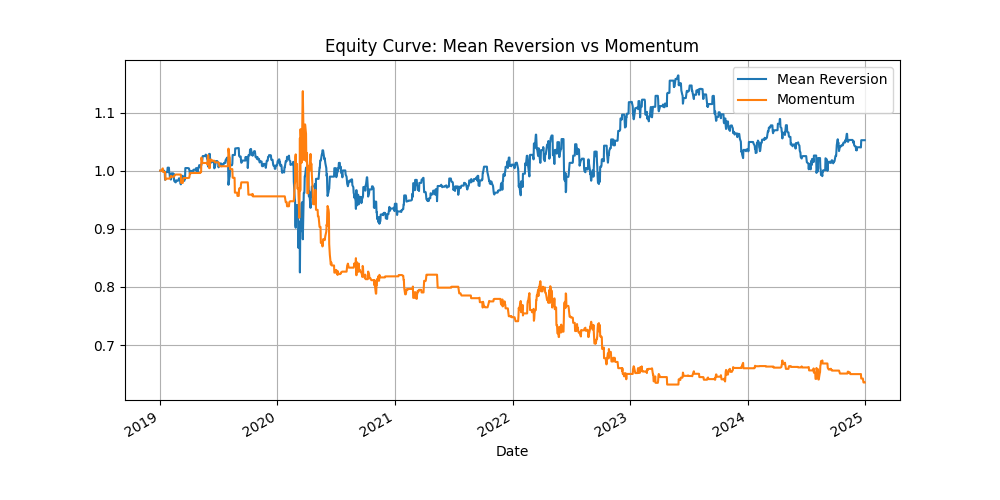

# Momentum vs Mean Reversion: Trading Strategy Comparison

This project implements and compares two popular trading strategies — **Momentum** and **Mean Reversion** — using historical data from SPY and selected large-cap stocks. The goal is to evaluate their performance and risk metrics through backtesting in Python.

## 📊 Strategies Overview

- **Momentum**: Buy when 5-day returns exceed 2%, sell when below -2%.
- **Mean Reversion**: Buy when the Z-score of the 10-day moving average is below -1, sell when above 1.

## 🧪 Methodology

- **Data Source**: Yahoo Finance via `yfinance`
- **Assets**: SPY, AAPL, MSFT, GOOGL, NVDA, AMZN
- **Time Period**: 2019–2024
- **Evaluation Metrics**:
  - Sharpe Ratio
  - Maximum Drawdown
  - Hit Ratio (win rate)
  - Equity Curve

## 📁 Project Structure 

```
.
├── strategy_comparison.py       # Main Python script
├── README.md                    # Project description
└── example_output.png           # (Optional) Sample equity curve
```

## 📈 Example Output

Both strategies were backtested and visualized. Below is a sample equity curve:



## 🔧 Requirements

- Python 3.x
- pandas
- numpy
- matplotlib
- yfinance

Install all dependencies with:

```bash
pip install pandas numpy matplotlib yfinance
```

📃 License
MIT License