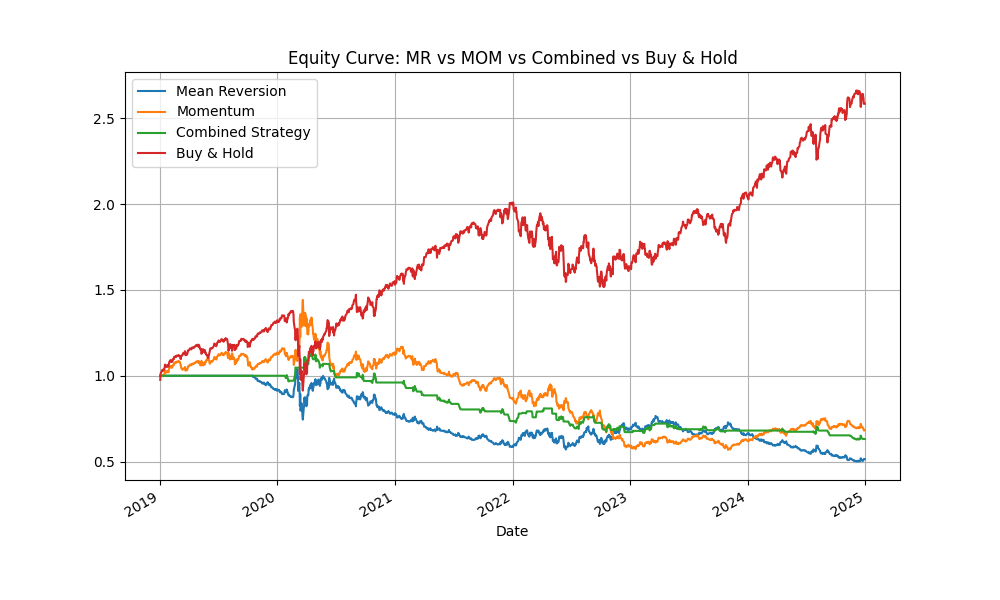
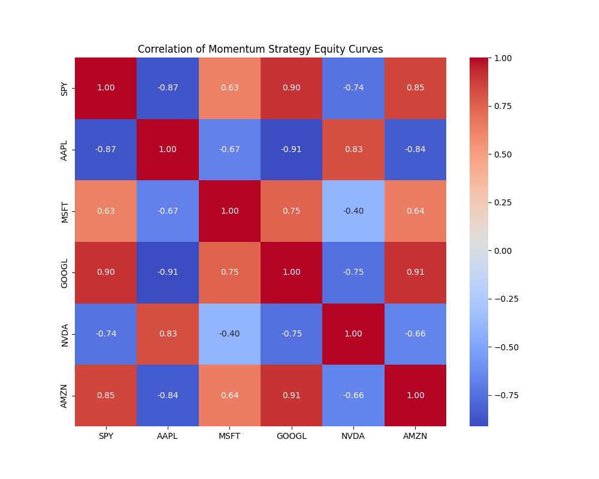

# Momentum vs Mean Reversion: Trading Strategy Backtest

This project implements and compares three trading strategies:

- **Momentum**
- **Mean Reversion**
- **Combined (Momentum + Mean Reversion)**
- **Buy & Hold (benchmark)**

It uses historical stock data to evaluate performance and risk through backtesting in Python.

## 📊 Strategy Logic

- **Momentum**: Go long if 5-day return > 2%, short if < -2%.
- **Mean Reversion**: Go long if Z-score (10-day MA) < -1 and price < 200-day MA, short if Z-score > 1 and price > 200-day MA.
- **Combined Strategy**: Hybrid of Momentum and Mean Reversion, averaging their signals.
- **Buy & Hold**: Simply buy and hold the asset over the period.

## 🧪 Methodology

- **Data Source**: Yahoo Finance via `yfinance`
- **Assets Tested**: SPY, AAPL, MSFT, GOOGL, NVDA, AMZN
- **Backtest Period**: 2019–2024
- **Transaction Costs**: All strategies account for transaction costs (default: 0.1% per trade), applied whenever the position changes. This ensures more realistic performance estimates.
- **Evaluation Metrics**:
  - Sharpe Ratio
  - Sortino Ratio
  - Volatility
  - CAGR (Compound Annual Growth Rate)
  - Max Drawdown
  - Hit Ratio (win rate)
  - Number of Trades
  - Average Profit per Trade
  - Equity Curve Plot

## 📁 Project Structure

```
├── main.py       
├── README.md    
├── datasets/                
└── images/

```

## 📈 Example Output

Initial test on SPY comparing Momentum and simple Z-score-based Mean Reversion (no SMA 200 filter).


In the next test, I applied a 200-day moving average filter to the Mean Reversion strategy to avoid counter-trend trades.


Finally, I added a Buy & Hold benchmark to compare how a passive investment approach would have performed over the same period.


All equity curves and metrics now reflect results after accounting for transaction costs, making the backtest more realistic.



I created a heatmap showing the correlation of momentum strategy equity curves across different stocks.



## Strategy Backtest Summary for SPY

Here are the performance metrics of each strategy applied to SPY:

| Strategy       | Sharpe | Sortino | Volatility | CAGR  | Max Drawdown | Hit Ratio | Trades | Avg Profit/Trade | Ticker |
|----------------|--------|---------|------------|-------|---------------|-----------|--------|------------------|--------|
| Mean Reversion | -0.45  | -0.60   | 0.19       | -0.10 | 0.52          | 0.38      | 17     | -0.0023          | SPY    |
| Momentum       | -0.07  | -0.09   | 0.20       | -0.03 | 0.81          | 0.52      | 95     | 0.0011           | SPY    |
| Combined       | -0.52  | -0.44   | 0.10       | -0.06 | 0.47          | 0.11      | 98     | 0.0002           | SPY    |
| Buy & Hold     | 0.90   | 1.09    | 0.20       | 0.17  | 0.49          | 0.56      | -      | -                | SPY    |

➡️ See full results in [strategy_results.csv](strategy_results.csv)

## 🔧 Requirements

- Python 3.x
- pandas
- numpy
- matplotlib
- yfinance

Install all dependencies with:

```bash
pip install pandas numpy matplotlib yfinance
```

## 📃 License
MIT License