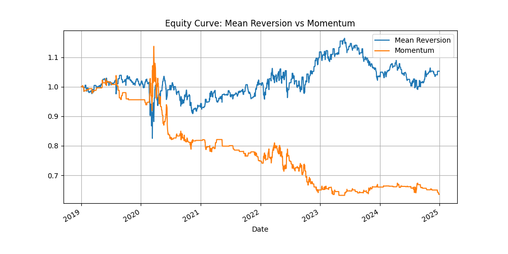
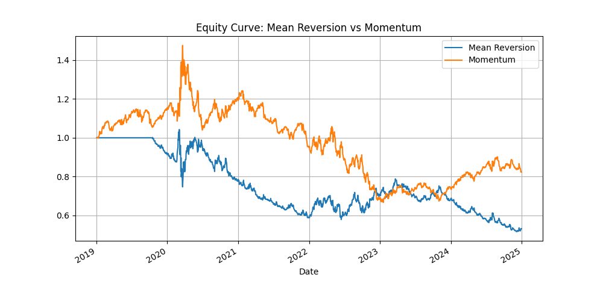
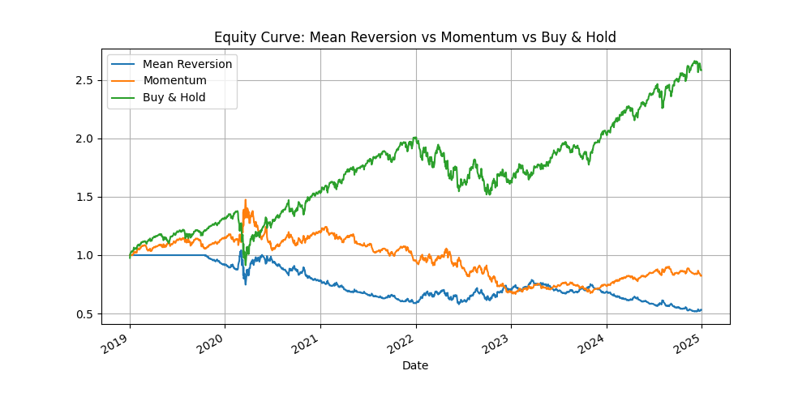
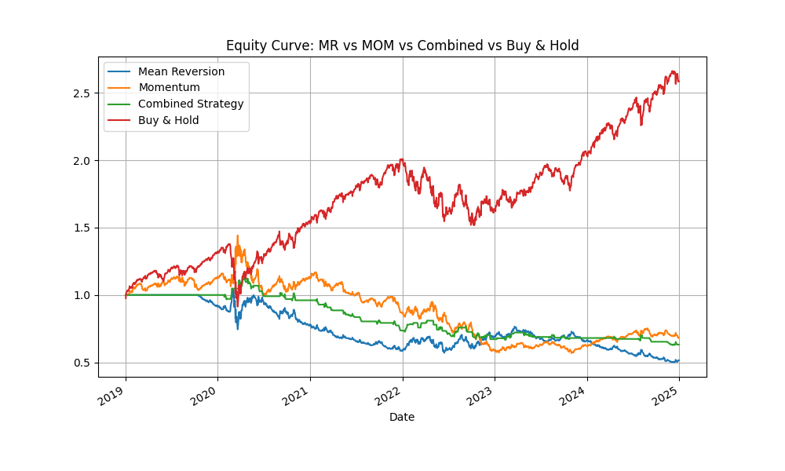
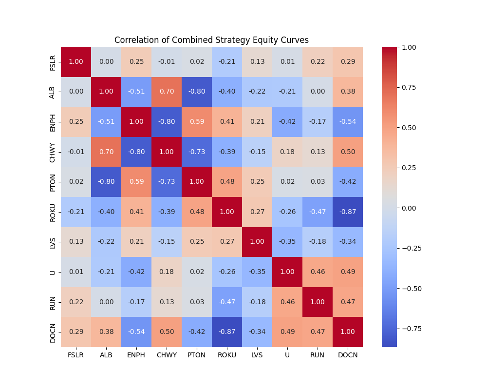

# Momentum vs Mean Reversion: Trading Strategy Backtest

This project implements and compares three trading strategies:

- **Momentum**
- **Mean Reversion**
- **Combined (Momentum + Mean Reversion)**
- **Buy & Hold (benchmark)**

It uses historical stock data to evaluate performance and risk through backtesting in Python.

## 📊 Strategy Logic

- **Momentum**: Long if 20-day return exceeds mom_threshold, MACD confirms uptrend, RSI > 50, and above average volume.
- **Mean Reversion**: Mean Reversion: Long when Z-score < -z_threshold, price below 200-day MA, RSI < 30, ATR above rolling average, and above average volume.
- **Combined Strategy**: Takes the average position from both strategies and rounds to nearest integer.
- **Buy & Hold**: Simply buy and hold the asset over the period.

## 🧪 Methodology

- **Data Source**: Yahoo Finance via `yfinance`
- **Assets Tested**: SPY, AAPL, MSFT, GOOGL, NVDA, AMZN
- **Backtest Period**: 2019–2024
- **Transaction Costs**: All strategies account for transaction costs (default: 0.1% per trade), applied whenever the position changes. This ensures more realistic performance estimates.
- **Evaluation Metrics**:
  - Sharpe Ratio
  - Sortino Ratio
  - Volatility
  - CAGR (Compound Annual Growth Rate)
  - Max Drawdown
  - Hit Ratio (win rate)
  - Number of Trades
  - Average Profit per Trade
  - Equity Curve Plot

## 📁 Project Structure

```
├── main.py       
├── README.md    
├── processed_data/                
└── images/

```

## 📈 Example Output

Initial test on SPY comparing Momentum and simple Z-score-based Mean Reversion (no SMA 200 filter).



In the next test, I applied a 200-day moving average filter to the Mean Reversion strategy to avoid counter-trend trades.



Finally, I added a Buy & Hold benchmark to compare how a passive investment approach would have performed over the same period.



All equity curves and metrics now reflect results after accounting for transaction costs, making the backtest more realistic.



I created a heat map showing the correlation of the momentum strategy's stock curves on various mid-cap stocks, but removed the funciton of creating this.



## Strategy Backtest Summary for SPY

Here are the performance metrics of the best strategy applied to each ticker:

| Strategy       | Sharpe | Sortino | Volatility | CAGR  | Max Drawdown | Hit Ratio | Trades | Avg Profit/Trade | Ticker | Cap  | Fee   | Slippage |
|----------------|--------|---------|------------|-------|---------------|-----------|--------|------------------|--------|------|-------|----------|
| Buy & Hold     | 1.18   | 1.64    | 0.31       | 0.37  | 1.47          | 0.54      | -      | -                | AAPL   | Large | 0.005 | 0.0001   |
| Buy & Hold     | 0.69   | 0.99    | 0.34       | 0.19  | 1.36          | 0.52      | -      | -                | AMZN   | Large | 0.005 | 0.0001   |
| Buy & Hold     | 1.45   | 2.29    | 0.52       | 0.86  | 10.85         | 0.55      | -      | -                | NVDA   | Large | 0.005 | 0.0001   |
| Buy & Hold     | 1.01   | 1.38    | 0.29       | 0.28  | 1.3           | 0.54      | -      | -                | MSFT   | Large | 0.005 | 0.0001   |
| Combined       | 1.02   | 0.93    | 0.1        | 0.1   | 0.28          | 0.29      | 11     | 0.0023           | SPY    | Large | 0.005 | 0.0001   |
| Buy & Hold     | 0.85   | 1.17    | 0.31       | 0.24  | 1.26          | 0.54      | -      | -                | GOOGL  | Large | 0.005 | 0.0001   |
| Mean Reversion | 0.41   | 0.62    | 0.77       | 0.02  | 1.46          | 0.4       | 12     | -0.028           | RUN    | Mid   | 0.005 | 0.0001   |
| Buy & Hold     | 0.55   | 0.84    | 0.73       | 0.15  | 13.55         | 0.51      | -      | -                | ROKU   | Mid   | 0.005 | 0.0001   |
| Momentum       | 0.72   | 0.96    | 0.81       | 0.29  | 4.85          | 0.45      | 7      | 0.0019           | PTON   | Mid   | 0.005 | 0.0001   |
| Mean Reversion | 0.76   | 1.04    | 0.41       | 0.26  | 0.8           | 0.42      | 11     | -0.0111          | LVS    | Mid   | 0.005 | 0.0001   |
| Combined       | 0.21   | 0.1     | 0.27       | 0.02  | 0.54          | 0.06      | 14     | -0.0093          | U      | Mid   | 0.005 | 0.0001   |
| Buy & Hold     | 0.72   | 1.14    | 0.51       | 0.27  | 2.93          | 0.51      | -      | -                | FSLR   | Mid   | 0.005 | 0.0001   |
| Buy & Hold     | 0.96   | 1.44    | 0.75       | 0.56  | 56.2          | 0.53      | -      | -                | ENPH   | Mid   | 0.005 | 0.0001   |
| Mean Reversion | 0.55   | 0.71    | 0.52       | 0.16  | 1.05          | 0.36      | 5      | 0.005            | DOCN   | Mid   | 0.005 | 0.0001   |
| Momentum       | 0.46   | 0.59    | 0.6        | 0.09  | 2.89          | 0.44      | 9      | 0.0009           | CHWY   | Mid   | 0.005 | 0.0001   |
| Buy & Hold     | 0.31   | 0.44    | 0.51       | 0.03  | 3.38          | 0.51      | -      | -                | ALB    | Mid   | 0.005 | 0.0001   |
| Combined       | 0.34   | 0.29    | 0.68       | -0.01 | 2.75          | 0.27      | 21     | 0.0029           | FUBO   | Small | 0.01  | 0.0001   |
| Buy & Hold     | 0.17   | 0.24    | 0.7        | -0.13 | 1.56          | 0.46      | -      | -                | OPK    | Small | 0.005 | 0.0001   |
| Buy & Hold     | 0.54   | 0.91    | 0.89       | 0.09  | 53.81         | 0.46      | -      | -                | PLUG   | Small | 0.005 | 0.0001   |
| Buy & Hold     | 0.82   | 1.55    | 1.14       | 0.35  | 43.63         | 0.46      | -      | -                | RIOT   | Small | 0.005 | 0.0001   |
| Mean Reversion | 0.26   | 0.34    | 1.04       | -0.24 | 1.48          | 0.37      | 8      | -0.0096          | BCLI   | Small | 0.005 | 0.0001   |
| Combined       | 0.37   | 0.24    | 0.4        | 0.07  | 0.82          | 0.14      | 13     | -0.0045          | SNDL   | Small | 0.005 | 0.0001   |
| Buy & Hold     | 0.44   | 0.84    | 0.76       | 0.06  | 1.76          | 0.48      | -      | -                | SOFI   | Small | 0.005 | 0.0001   |
| Momentum       | 0.51   | 0.8     | 0.74       | 0.15  | 1.97          | 0.42      | 17     | -0.0016          | LUMN   | Small | 0.02  | 0.0001   |
| Buy & Hold     | 0.93   | 1.88    | 1.37       | 0.5   | 47.99         | 0.45      | -      | -                | MARA   | Small | 0.005 | 0.0001   |

➡️ See full results in [best_strategies_all.csv](processed_data/best_strategies_all.csv)

## 📌 Conclusion

- **Buy & Hold often outperforms active strategies on large-cap stocks.**  
  Stocks like **NVDA** and **AAPL** delivered exceptional long-term performance, with NVDA achieving a **Sharpe ratio of 1.45** and **CAGR of 0.86**. For strong trending stocks, passive investing proved highly effective.

- **Momentum strategies performed better than Mean Reversion overall**, especially on **mid- and small-cap stocks**. In some cases (e.g., **PTON**), Momentum even outperformed Buy & Hold, showing promise in volatile or breakout-driven markets.

- **Mean Reversion underperformed in most cases**, often resulting in **negative average profit per trade** and **low Sharpe ratios**. It may require more advanced filtering or could simply be less effective in a trend-heavy macro environment like 2019–2024.

- **Combined strategies delivered mixed results.**  
  While averaging signals helped smooth out decisions, it often **diluted the edge** and led to modest performance. However, in some cases like **SPY**, the Combined strategy slightly outperformed Buy & Hold.

- **Transaction costs had a real impact.**  
  Especially for small caps, **higher slippage and more frequent trades** often eroded performance—emphasizing the importance of execution-aware backtesting.

> Overall, passive investing dominated in trending large-cap names, but active strategies—particularly Momentum—show promise on more volatile stocks. Further refinements and adaptive parameter tuning could improve Mean Reversion results in future work.

## 🔧 Requirements

- Python 3.x
- pandas
- numpy
- matplotlib
- yfinance

Install all dependencies with:

```bash
pip install pandas numpy matplotlib yfinance
```

## 📃 License
MIT License